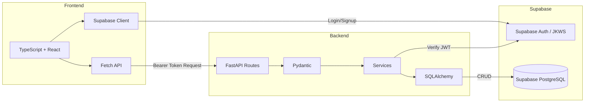

# Backend Architecture Flow

## Backend File Structure (WIP)
- `app/models/`
    - SQLAlchemy ORM database models
- `app/routes/`
    - FastAPI endpoints `auth.py`, `health.py`, etc
- `app/schemas/`
    - Pydantic request and response schemas
- `app/services/`
    - Enforces business logic like jwt validation via `jwt.py`
- `app/main.py`
    - FASTAPI entrypoint
- `app/config.py`
    - Enviornment variable loading from `backend/.env` and app config
- `app/database.py`
    - Database connection & SQLAlchemy session config
- `migrations/`
    - Versioned SQL migration files. See [migrations/README.md](migrations/README.md) for run/rollback instructions.
- `testing/`
    - Houses all backend tests
- `.env.example`
    - Holds placeholder environment variables. Make a copy and fill out the relevant credentials
- `requirements.txt`
    - Backend dependencies
